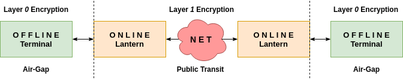

# lanterns

Private Communications No Holds Barred

An experimentation of encryption, comms, and hardware. This project serves as a testbed for securing the transmission of data.

## Stability

Experimental

## Branching Strategy

[Trunk Based Development](https://trunkbaseddevelopment.com/)

## Problem Statement

In the dawn of mobile communications, distributed systems and IoT, privacy has become an afterthought. Under a guise of enormous complexity, from circuitry to software, governing bodies, both private and civic, have demanded unrestrained access to personal data without checks and balances.

## Research

- Encryption Algorithm Viability
  - Security
    - Strength
    - Vulnerabilities
    - Future Proofing
  - Computational Cost
  - Implementation Cost
  - Multilayered Cost vs Benefit
 - Encryption Candidates
   - Rivest–Shamir–Adleman (RSA)
   - Elliptic-curve Diffie–Hellman (ECDH)
   - Rijndael - Advanced Encryption Standard (AES)

## Development

- CLI GUI
  - Persistent configurations
  - Reactive state management
  - User input handling
  - Components and Pages
- Terminal Chat
- Lantern
- Bluetooth Adapter
  - Search Devices
  - Pair with Device
  - Send / Receive
- WiFi Adapter
  - Search Devices
  - Connect Securely to Device
  - Send / Receive

## Architecture

### Payload Workflow

1. Offline Sender Terminal layer *0* encrypts payload
2. Offline Sender Terminal sends payload to Online Sender Lantern
3. Online Sender Lantern layer *1* encrypts payload
4. Online Sender Lantern sends payload to Online Receiver Lantern
5. Online Receiver Lantern layer *1* decrypts payload
6. Online Receiver Lantern sends payload to Offline Receiver Lantern
7. Offline Receiver Lantern layer *0* decrypts payload

## License

MIT
